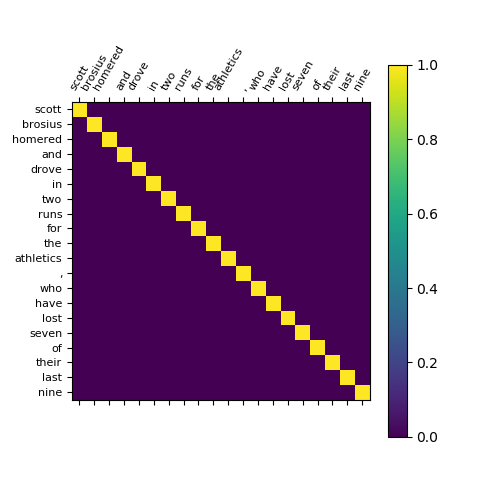

# Pytorch-BiLSTM-Attention-CRF

**Since some of the tricks will be used for article writing, so the code will is opened later.**

Use pytorch to finish BiLSTM-CRF and intergrate Attention mechanism！

 ----------------------------------2019-04-07--------------------------------------

Upload models, so that you can test the dev set directly !

 ---------------------------------upload models------------------------------------


**Notice**: This code can only run on the GPU, mainly because the test found that the CPU would consume considerable time. If you 
want to transfer to CPU all you need is to remove ```.cuda()``` in the whole code!


## Usage

For train:
```
 python train.py
 
```
For test:
```
python predict.py

```
**Notice: you could use ```-h``` for details of parameter usage**


## About attention

Provide code for visualization self-attention part!

example:




## Results

Current result in dev set! Here i just caculate the mean result of every batch on dev set with 50 EPOCHS!
```
=========================================

F_score=0.927 Recal_score=0.934

=========================================
```


